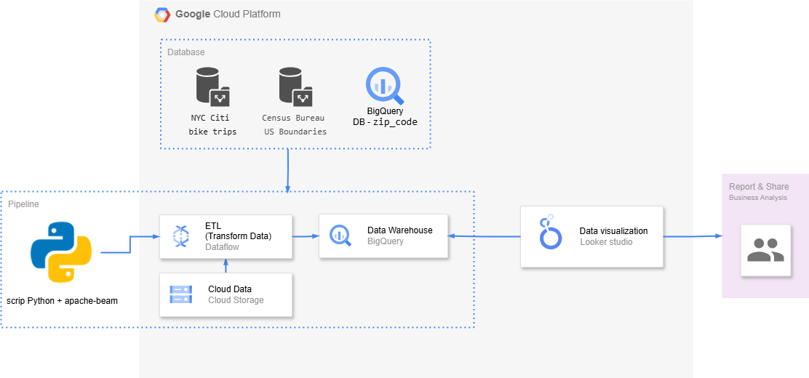
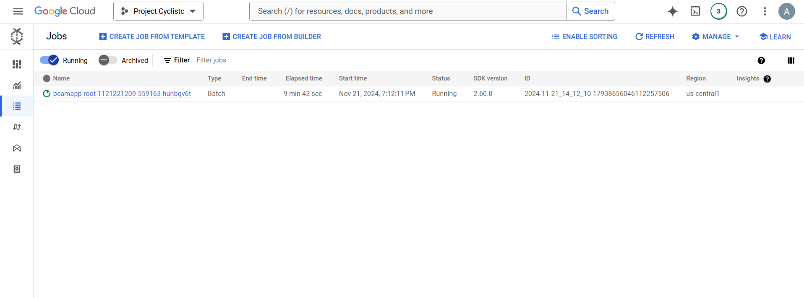

# Projeto Business Intelligence - Cyclistic

Este projeto foi elaborado durante o processo de certificação do Google Business Intelligence Certificate e tem como objetivo principal desenvolver uma **ferramenta de Business Intelligente**, que suporte a tomada de decisão dos times de negócios, passando pelas etapas: planejamento do projeto, preparação dos dados e criação do dashboard.

## Resultados e insights:
Abaixo listei os principais resultados e insights gerados ao time de negócios, com a construção dessa ferramenta alinhada ao objetivo - Criar um plano de negócio para aumento de clientes.

Você pode visualizar o dashboard aqui [Cyclistic project - Customer Growth](https://lookerstudio.google.com/reporting/b1c9425a-ae76-4759-9f60-082d38b08f5c)

1. As estações "Chelsea and Clinton" e "Lower east side" são os pontos com maior total de minutos de viagem, mostrando que são as estações onde os usuários utilizam para viagens de longa duração. 
Desta forma esses são os melhores pontos para:
 
💡Otimizar a distribuição das bicicletas, disponibilizando maior número nessas regiões.
 
💡Investir em novas estações nessas regiões geográficas, oferecendo mais opções de pontos retirada e entrega das bicicletas.

2. O pico do número de viagens acontece no Verão, deixando claro que a sazionalidade impacta na utilização do serviço.
 
💡Desenvolver estratégias de marketing específica para cada estação do ano.
💡Efetuar ajustes operacionais para otimização na distribuição das bicicletas e manutenção. 

3. O número de viagens aumenta com temperaturas amenas (entre 60°F e 80°F) e em dias com precipitação significativa, o número de viagens tende a ser menor. Já o vento não parece impactar o número de viagens.
 
💡Trabalhar em soluções para os dias úmidos: como disponibilização de capa de chuva, pode ajudar aumentar o uso.

4. Quando analisado o perfil de usuários, identificamos 30% são clientes ocasionais (customers) e o comportamento de uso esta relacionado diretamente ao verão e especificamente 3 pontos - Upper West Side, Northest Brooklyn e Lower Manhattan.
💡Investir em marketing de incentivo a clientes ocasionais a se tornarem clientes regulares, especialmente nessas localidades.
-----
 

### Processo de desenvolvimento do projeto:
**Contexto:** A Cyclistic é uma empresa de compartilhamento de bicicletas na cidade de NY, atualmente as estações de bicicletas estão localizadas em Manhattan e nos bairros vizinhos. Os clientes podem alugar bicicletas para se deslocar entre as estações nesses locais.
O time de Growth da Cyclistic está criando o plano de negócios para o próximo ano e quer entender como seus clientes estão usando as bicicletas, qual é a demanda dos clientes em diferentes estações, com o objetivo de aumentar o número de clientes.

Obs.: A Cyclistic e todos os dados compartilhados são fictícios 😉

## 1. Planejamento do projeto
A etapa mais importante no processo de desenvolvimento de uma ferramenta de BI, quando deve ocorrer reunião com os stakeholders do projeto para entender quem é esse público e suas necessidades, qual é o principal objetivo e definir o cronograma.

É essa etapa indicada para levantar as bases de dados que serão utilizadas e entender minimamente os dados, suas dependências e detalhar quais são as métricas de sucesso (mportante utilizar a técnica SMART).

Documentar a estratégia de criação do dashboard com os elementos e quais serão os gráficos com suas dimensões e métricas, é relevante para direcionar na etapa de data viz e também importante para o sucesso do projeto.

**Objetivo:** Criar uma solução de BI que ofereça insights estratégicos para os times de negócios, utilizando dados públicos e privados para apoiar decisões baseadas em evidências.

## 2. Dados, Ferramentas e o Pipeline
Os dados utilizadas no desenvolvimento do projeto são de datasets públicos que podem ser acessados nos links abaixo, e uma [tabela](zip_codes.xlsx) de código postal, que adicionei ao banco.
- [NYC Citi bike trips](https://console.cloud.google.com/marketplace/details/city-of-new-york/nyc-citi-bike?project=light-cathode-442210-i5)
- [Census Bureau US Boundaries](https://console.cloud.google.com/marketplace/product/united-states-census-bureau/us-geographic-boundaries?project=light-cathode-442210-i5)

**Principais dados utilizados:**
- Data e hora inicío e fim da viagem start time and location 
- Dados de localização de inicío e fim da viagem (código postal, rua, bairro)
- Latitude e longitude de inicío e fim da viagem 
- ID bike
- Tipo de cliente (clientes ocasionais ou regulares)
- Média da temperatura ref. data viagem
- Média do vento ref. data viagem
- Preciptação total red. data viagem (possibilidade de chuva)

**Construção do pipeline**
As informações são extraídas, tratadas (limpeza de nulos e filtro do período específico) e gravadas nas tabelas processadas no BigQuery (historic_user e historic_user_summer). O pipeline final do projeto com todas as ferramentas:

 

>**Ferramentas:** 
>- BigQuery 
>- DataFlow
>- Python
>- Looker Studio 

>➕ Criei o script usando Python + Apache Beam (ao invés de um job no console do GCP) para aproveitar a oportunidade e testar também a ferramenta Google Colaboratory. E particularmente, achei muito legal, pode ser uma ótima opção para quem está começando a programar devido a integração com a Gemini AI👌

## 3. Dashboard
As tabelas tratados foram integradas com o Looker Studio para a criação do dashboard, que permite a visualização clara e iterativa dos indicadores estabelecidos no planejamento. O dashbaord foi subdividido em 4 visualizações, para facilitar a interpretação dos dados.
- Totais
- Sazonalidade
- Clima
- Tendência no verão

**Filtros Dinâmicos:** Inclui diversos filtros em todas as visualizações, para que os dados possam ser segmentados.

**Visualizações Interativas:** Adicional aos gráficos, inclui também tabelas e mapa de calor para tornar a interpretação dos dados mais intuitiva aos usuários.

### Próximos passos: 
Implementar recursos de previsão utilizando modelos estatísticos ou machine learning.

-----
 
Este projeto demonstra a aplicação prática de conceitos fundamentais de BI, passando por todas as etapas de desenvolvimento, e está disponível para consulta neste repositório. Caso tenha sugestões ou comentários, fique à vontade para contribuir! 😊